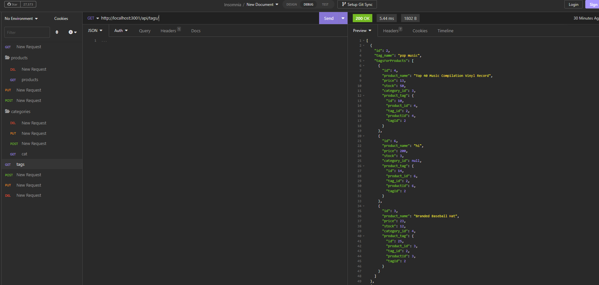

# ROUTES AND MYSQL!#

## Description

### What was your motivation?

* my motivation for this readme was to understand how mysql works
### Why did you build this project? 
* this solves data storage for users that are selling prducts
### What problem does it solve?
* i built this to help myself understand what im looking at in future projects.
### What did you learn?
* i learned how to join tables, add primary keys etc, and create routes for them.
## Table of Contents

If your README is long, add a table of contents to make it easy for users to find what they need.

- [Installation](#installation)
- [Usage](#usage)
- [Credits](#credits)
- [License](#license)

## Installation

For installation please go to your cli and clone this url undefined
To use this generator, simply clone the repository to your local machine and run the index.js 
file in your terminal. The tool will guide you through the process of creating your
 readme.md file, providing helpful prompts and examples along the way. Once you have
 completed the prompts, your new readme.md file will be generated and ready to use.

## Usage

    

## Credits
* Collaborators
n/a

## License
MIT
## Technology
JS
